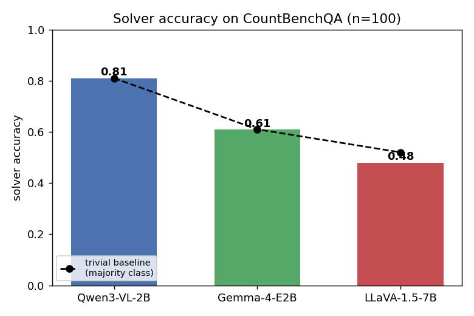
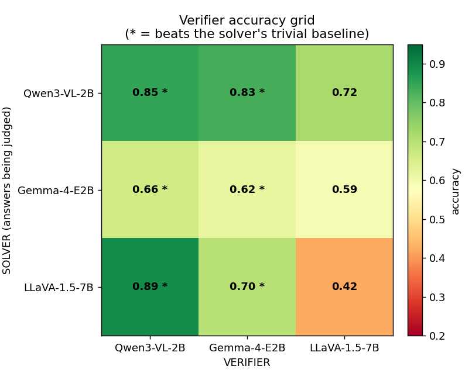
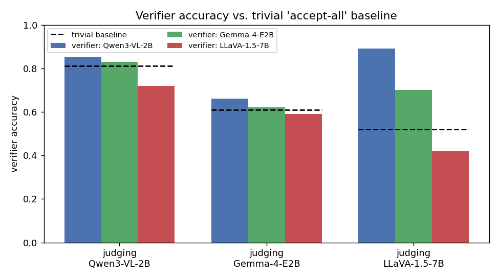
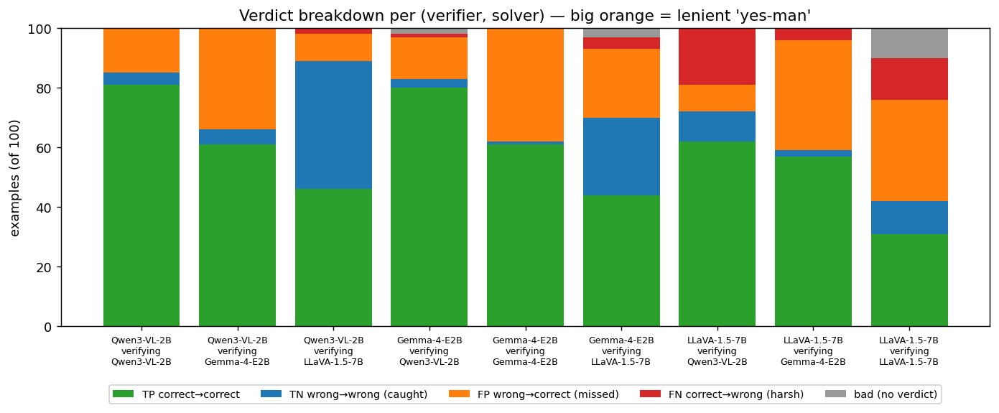
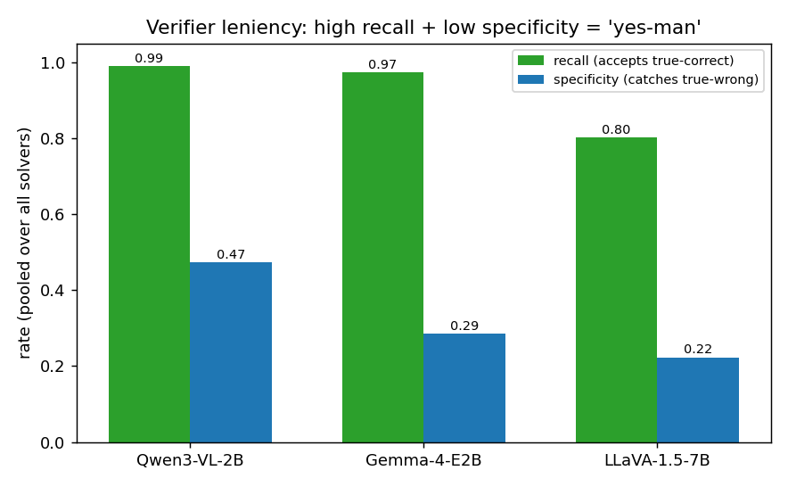

# VLM Solver–Verifier Results — Visualized

CountBenchQA (n=100). Three VLMs as both solver and verifier; every model verifies every
model. See `vlm/REPORT.md` for the full writeup and `vlm/result/verify_*.json` for raw data.

## Solver accuracy

## Verifier accuracy grid
Rows = solver whose answers are being judged; columns = verifier. `*` marks cells that beat
the solver's trivial "accept-all" baseline.

## Verifier vs. trivial baseline
A verifier only adds value if it clears the dashed line (the majority-class baseline).
Only Qwen3-VL-2B does so consistently.

## Verdict breakdown (TP / TN / FP / FN / bad)
Positive class = "solver was correct". Large **orange (FP)** = the verifier rubber-stamps
wrong answers; **blue (TN)** = it actually caught wrong answers. LLaVA shows large grey
(no parseable verdict).

## Leniency: recall vs. specificity
High recall + low specificity = a lenient "yes-man" that accepts almost everything. Only
Qwen3-VL-2B has meaningful specificity (catches wrong answers).

