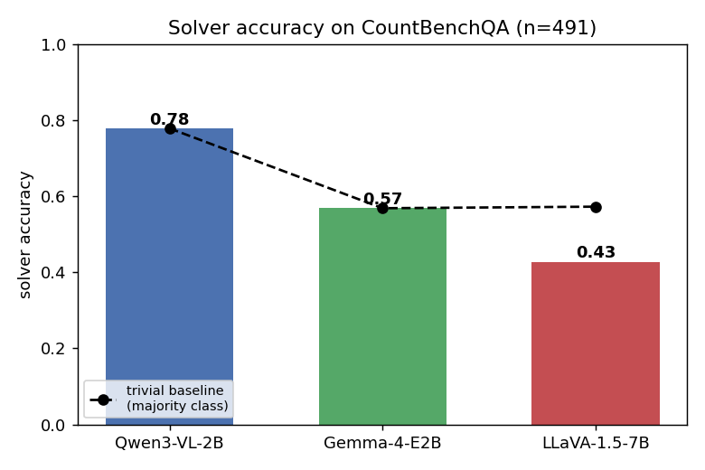
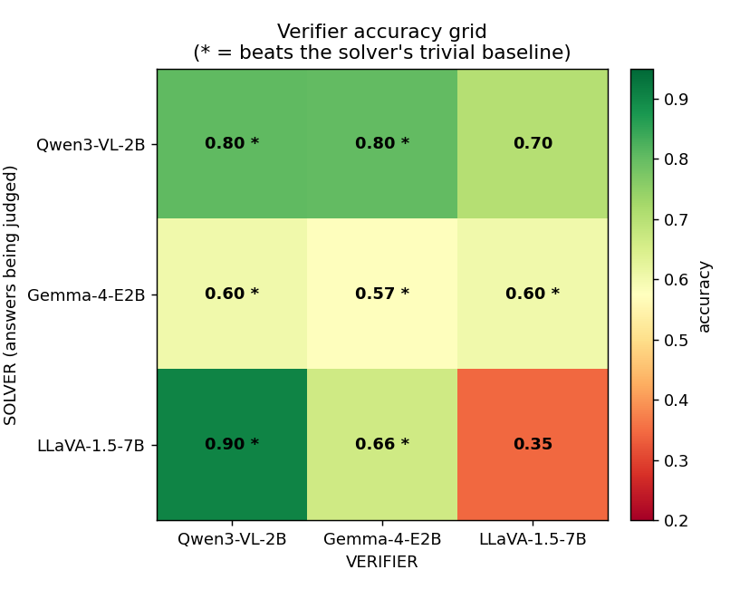
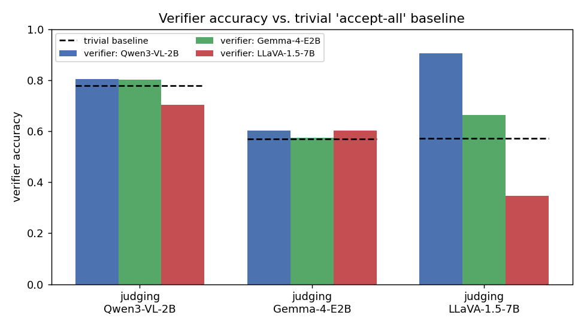
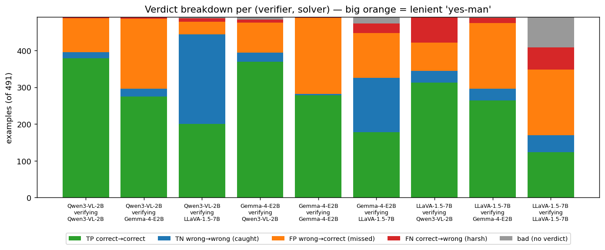
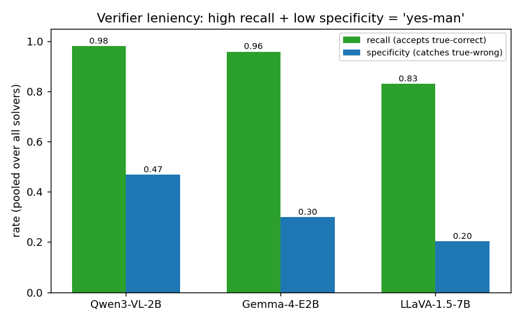

# VLM Solver–Verifier Results — Visualized

CountBenchQA (n=491). Three VLMs as both solver and verifier; every model verifies every
model. Raw data: the `verify_*.json` files in `vlm/result/countbench`.

## Solver accuracy

## Verifier accuracy grid
Rows = solver whose answers are being judged; columns = verifier. `*` marks cells that beat
the solver's trivial "accept-all" baseline.

## Verifier vs. trivial baseline
A verifier only adds value if it clears the dashed line (the majority-class baseline).

## Verdict breakdown (TP / TN / FP / FN / bad)
Positive class = "solver was correct". Large **orange (FP)** = the verifier rubber-stamps
wrong answers; **blue (TN)** = it actually caught wrong answers; **grey** = no parseable verdict.

## Leniency: recall vs. specificity
High recall + low specificity = a lenient "yes-man" that accepts almost everything;
high specificity means the verifier actually catches wrong answers.

